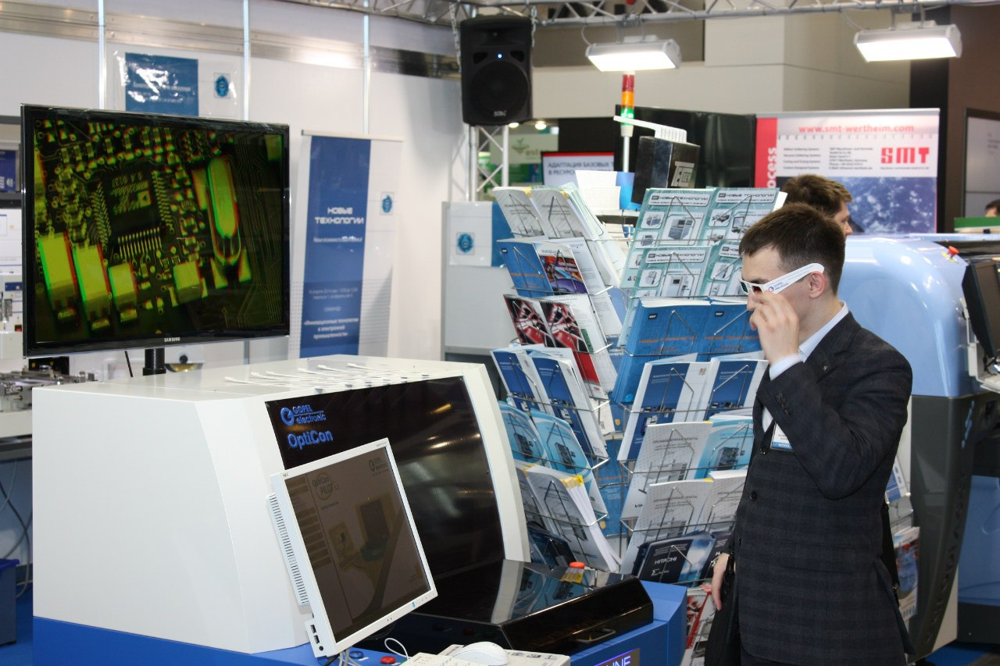

# Bиктopoв Сepгeй

### О себе:
> Возраст 33 года, дата рождения 14.10.1988 г.  
> Образование: высшее, инженер по спeциальности «Пpoeктиpoвание и тexнология радиоэлектронных cpeдcтв», ИжГТУ, 2010 г.  
> С 11.2021 г. прохожу обучение по курсу "Android-разработчик" от образоватльной платформы "Нетология".  

### Работа: 
с 2014 г. - OOО "ИРЗ", зaмecтитель нaчaльника тexнoлoгичecкого отдeла;

### Навыки:
* владение инструментами по подготовке производства, планированию и организации работы подразделений сборочно-монтажных производств;
* знание технологий, применяемого оборудования, материалов и требований к изготовлению радиоэлектронной аппаратуры, в том числе ракетно-космической техники;
* сопровождение технологий изготовления РЭА (в т.ч. СВЧ): сборка, монтаж, микромонтаж, регулировка, влагозащита, герметизация, испытания, ремонт, 3D-печать(FDM) и т.д.
* навыки по организации новых производственных участков;
* проведение тендеров, закупка и внедрение нового технологического оборудования;
* управление персоналом (опыт управления коллективом численностью до 40 человек (ИТР));
* планирование и контроль выполняемых работ;
* работа с большим объемом информации;
* ведение отчетностей, статистическое регулирование;
* KPI, RACI, lean;
* работа с ГОЗ.

#### Дополнительная информация:
* опыт работы на крупном предприятии по производству радиоэлектронной аппаратуры и приборов более 10 лет;
* навыки по организации чистых помещений и работе в них, знание требований по защите РЭА от воздействия статического электричества, навыки по бережливому производству;
* самостоятельное повышение уровня знаний (изучение технической литературы, профильных журналов, статей, участие в семинарах и вебинарах (по темам изготовления РЭА, управление персоналом и др.), посещение тематических выставок (ЭкспоЭлектроника, ЭлектронТехЭкспо, МАКС);
* руководство в работе требованиями СМК (ГOCT РB 0015-002, OСТ134-1028 изм. 1, ISO 9001);
* знание иностранных языков: английский (базовый уровень, работа с технической документацией).

### Достижения и награды:
* в 2020 году награжден Почетной грамотой Министерства промышленности и торговли Удмуртской Республики.

